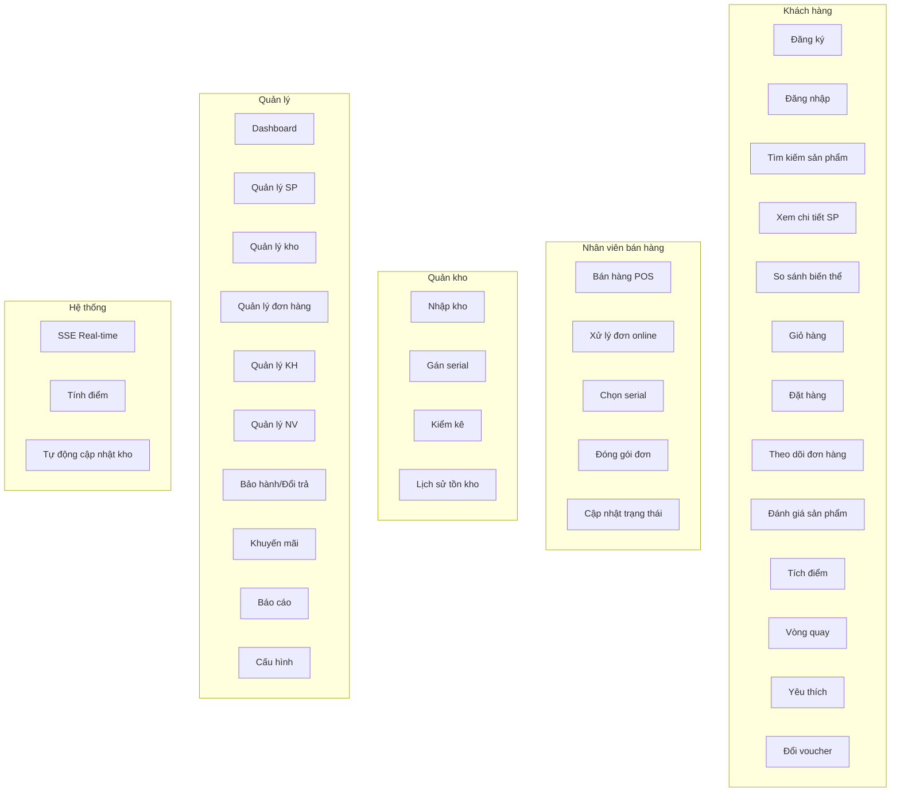
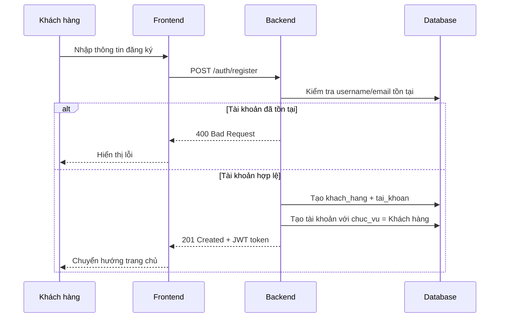
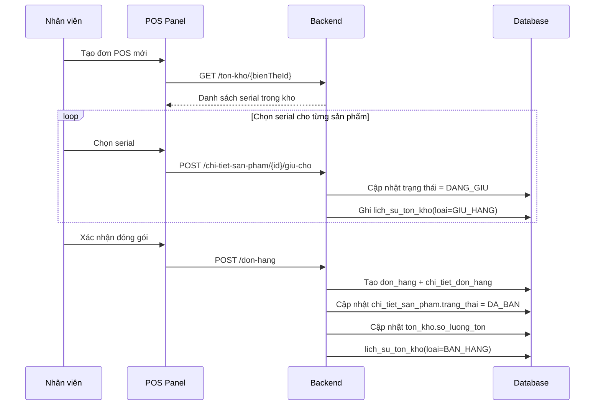
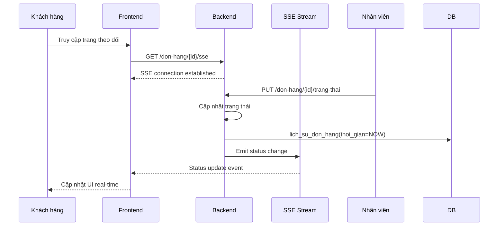
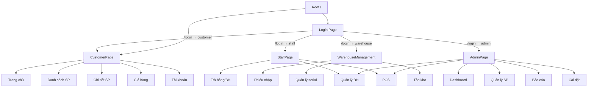
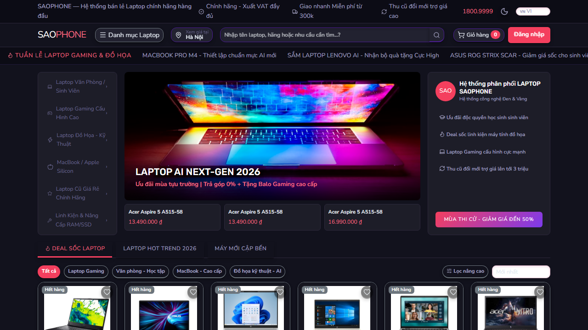
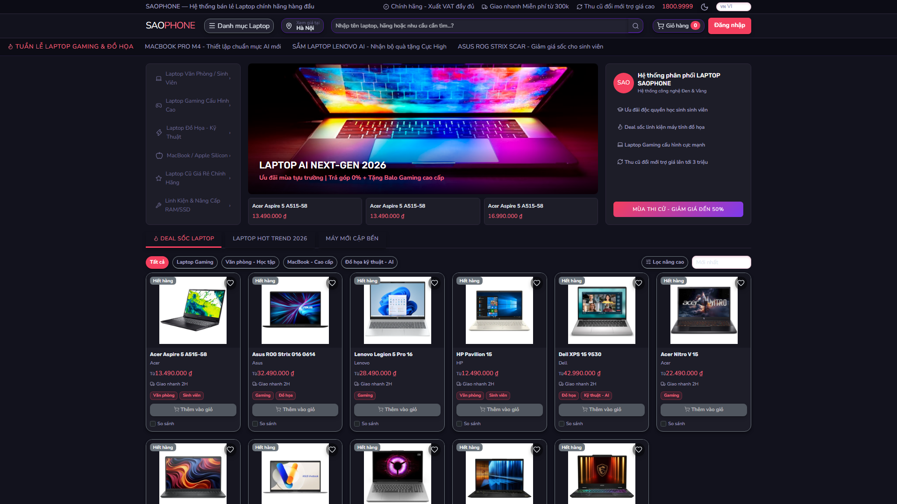

# BÁO CÁO DỰ ÁN TỐT NGHIỆP
## Xây dựng website bán máy tính SAOClub

---

**Trường Cao đẳng FPT Polytechnic**

| Thông tin | Chi tiết |
|-----------|----------|
| Giáo viên hướng dẫn | Nguyễn Quang Hà |
| Chuyên ngành | Phát triển phần mềm |
| Nhóm thực hiện | SD-16 |
| Sinh viên | Lê Huy Đỗ (PH60048), Lê Anh Ngữ (PH60049), Nghiêm Việt Anh (PH59725), Nguyễn Thành Đạt (PH60102), Nguyễn Xuân Việt (PH59601), Vũ Quang Huy (PH61463) |
| Thời gian | Hà Nội - 2026 |

---

## Mục lục

1. [Lời cảm ơn](#lời-cảm-ơn)
2. [Tóm tắt dự án](#tóm-tắt-dự-án)
3. [Phần 1: Giới thiệu](#phần-1-giới-thiệu)
4. [Phần 2: Phân tích](#phần-2-phân-tích)
   - 2.1. Yêu cầu người dùng
   - 2.2. Use Case
   - 2.3. Quan hệ thực thể (ERD)
5. [Phần 3: Thiết kế](#phần-3-thiết-kế)
   - 3.1. Danh sách bảng (44 bảng)
   - 3.2. Đặc tả chi tiết các bảng
   - 3.3. API Endpoints
   - 3.4. Thiết kế giao diện người dùng
6. [Phần 4: Triển khai](#phần-4-triển-khai)
   - 4.1. Kiến trúc hệ thống
   - 4.2. Công nghệ sử dụng
   - 4.3. Tổ chức mã nguồn
   - 4.4. Kỹ thuật triển khai nổi bật
   - 4.5. Hướng dẫn cài đặt
7. [Phần 5: Kiểm thử](#phần-5-kiểm-thử)
8. [Phần 6: Tổng kết và đánh giá](#phần-6-tổng-kết-và-đánh-giá)

---

## Lời cảm ơn

Báo cáo dự án tốt nghiệp "Xây dựng website bán máy tính SAOClub" không chỉ là kết quả của quá trình nỗ lực của tất cả các thành viên nhóm SD-16, mà còn là thành quả của sự hướng dẫn, hỗ trợ và động viên từ phía quý Thầy/Cô, bạn bè và gia đình.

Đặc biệt, chúng em xin gửi lời tri ân đến Thầy Nguyễn Quang Hà - giảng viên hướng dẫn của nhóm.

---

## Tóm tắt dự án

### Đặc thù thị trường máy tính

Thị trường máy tính – laptop tại Việt Nam có đặc thù rất khác so với các mặt hàng tiêu dùng thông thường:
- Giá trị đơn hàng cao
- Mỗi sản phẩm có nhiều biến thể cấu hình (CPU, RAM, ổ cứng, card đồ họa)
- Mỗi máy là một đơn vị vật lý riêng biệt có số serial và thời hạn bảo hành riêng

### Giải pháp

Dự án "Xây dựng website bán máy tính SAOClub" giải quyết đồng thời hai bài toán:
1. **Website thương mại điện tử** - khách hàng tìm kiếm, so sánh cấu hình và đặt mua trực tuyến
2. **Hệ thống quản trị nội bộ** - quản lý kho, tồn kho theo serial, bán hàng tại quầy, xử lý đơn online, đổi trả, bảo hành, thống kê

### Phân quyền 4 nhóm người dùng

| Vai trò | Không gian làm việc |
|---------|---------------------|
| Khách hàng | Duởi, lọc sản phẩm, giỏ hàng, đặt hàng, tích điểm, vòng quay |
| Quản lý (admin) | Toàn quyền hệ thống, báo cáo thống kê |
| Nhân viên bán hàng | POS, xử lý đơn online, đổi trả, bảo hành |
| Quản kho | Nhập kho, gán serial, kiểm kê |

### Điểm khác biệt

- **Quản lý tồn kho theo serial** - mỗi máy có số serial theo suốt vòng đời
- **Chuẩn hóa thông số kỹ thuật** - lọc và so sánh cấu hình chính xác
- **Server-Sent Events** - cập nhật trạng thái đơn hàng theo thời gian thực

---

## Phần 1: Giới thiệu

### 1.1. Bối cảnh hiện trạng

#### 1.1.1. Thị trường thương mại điện tử

Thương mại điện tử tại Việt Nam đã chuyển từ kênh bán hàng phụ trợ thành kênh chính. Đối với mặt hàng máy tính, khách hàng nghiên cứu rất kỹ thông số kỹ thuật trước khi quyết định mua.

**Ưu điểm mua sắm trực tuyến:**
- Tiết kiệm thời gian di chuyển
- So sánh dễ dàng nhiều sản phẩm
- Thông tin đầy đủ, đánh giá từ người mua trước
- Đa dạng lựa chọn không giới hạn bởi diện tích trưng bày
- Nhiều hình thức ưu đãi

#### 1.1.2. Khó khăn đặc thù quản lý cửa hàng máy tính

1. **Quản lý tồn kho theo số lượng là không đủ** - cần biết chính xác máy nào được bán ngày nào, cho ai
2. **Thông số kỹ thuật nếu nhập tự do** - không thể lọc và so sánh chính xác
3. **Quy trình sau bán hàng** - đổi trả, bảo hành liên quan chặt chẽ tới đơn hàng gốc và đúng chiếc máy

### 1.2. Khảo sát

#### 1.2.1. Kết quả khảo sát website

| Website | Strengths | Weaknesses |
|---------|-----------|------------|
| thegioididong.com | Giao diện tốt, nhiều thông tin | Không hỗ trợ so sánh cấu hình chi tiết |
| gearvn.com | Cấu hình chi tiết, đánh giá tốt | Quản lý serial hạn chế |
| phongvu.vn | Giá cạnh tranh | Ít tích hợp bảo hành |

#### 1.2.2. Khảo sát thực tế cửa hàng

Nhóm đã khảo sát tại cửa hàng máy tính và phát hiện:
- Quy trình bán hàng chủ yếu thủ công
- Quản lý serial bằng file Excel rời rạc
- Khó truy vết bảo hành khi cần

### 1.3. Yêu cầu và phạm vi

#### 1.3.1. Phạm vi chức năng

**Khách hàng:**
- Tìm kiếm, lọc sản phẩm theo cấu hình
- So sánh biến thể cấu hình
- Quản lý giỏ hàng, đặt hàng
- Theo dõi trạng thái đơn (SSE real-time)
- Đánh giá sản phẩm
- Tích điểm, đổi voucher
- Tham gia vòng quay may mắn

**Quản lý:**
- Quản lý sản phẩm, biến thể, hình ảnh
- Quản lý danh mục thông số kỹ thuật (CPU, RAM, ổ cứng, GPU)
- Quản lý tồn kho, serial
- Quản lý đơn hàng, thanh toán, đổi trả, bảo hành
- Quản lý khuyến mãi, khách hàng, nhân viên
- Báo cáo thống kê
- Cấu hình hệ thống

**Nhân viên bán hàng:**
- Bán hàng tại quầy (POS)
- Chọn serial và đóng gói đơn
- Xử lý đơn online
- Tiếp nhận đổi trả, bảo hành

**Quản kho:**
- Lập phiếu nhập kho
- Gán và quản lý serial
- Kiểm kê tồn kho
- Theo dõi lịch sử biến động tồn kho

#### 1.3.2. Giới hạn đề tài

- Chưa tích hợp cổng thanh toán thật (VNPay, MoMo)
- Chưa tích hợp API đơn vị vận chuyển
- Chưa xây dựng ứng dụng di động native
- Chưa có chat trực tuyến
- Chưa có hệ thống gợi ý sản phẩm AI

---

## Phần 2: Phân tích

### 2.1. Yêu cầu người dùng

#### 2.1.1. Yêu cầu chức năng

| STT | Người dùng | Tính năng | Mô tả |
|-----|------------|-----------|-------|
| 1 | Khách hàng | Đăng ký/Đăng nhập | Tạo tài khoản, xác thực JWT |
| 2 | Khách hàng | Tìm kiếm sản phẩm | Tìm theo tên, lọc theo cấu hình |
| 3 | Khách hàng | Xem chi tiết sản phẩm | Hình ảnh, thông số, đánh giá |
| 4 | Khách hàng | So sánh biến thể | So sánh cấu hình nhiều biến thể |
| 5 | Khách hàng | Giỏ hàng | Thêm, sửa, xóa sản phẩm |
| 6 | Khách hàng | Đặt hàng | Chọn địa chỉ, thanh toán |
| 7 | Khách hàng | Theo dõi đơn hàng | Xem trạng thái real-time |
| 8 | Khách hàng | Đánh giá sản phẩm | Cho sao, viết bình luận |
| 9 | Khách hàng | Tích điểm | Cộng điểm sau mua hàng |
| 10 | Khách hàng | Vòng quay may mắn | Đổi điểm lấy lượt quay |
| 11 | Admin | CRUD sản phẩm | Thêm, sửa, xóa sản phẩm |
| 12 | Admin | Quản lý serial | Gán serial cho máy |
| 13 | Admin | Quản lý đơn hàng | Xem, cập nhật trạng thái |
| 14 | Admin | Bán hàng POS | Tạo đơn tại quầy |
| 15 | Admin | Báo cáo thống kê | Doanh thu, tồn kho, sản phẩm |

#### 2.1.2. Yêu cầu phi chức năng

| Yêu cầu | Mô tả |
|----------|--------|
| Hiệu năng | Thời gian phản hồi < 2s cho 95% request |
| Bảo mật | JWT authentication, mã hóa mật khẩu BCrypt |
| Khả dụng | Hệ thống hoạt động 24/7 |
| Khả năng mở rộng | Kiến trúc microservice |
| Đa ngôn ngữ | 5 ngôn ngữ (VI, EN, JP, KR, CN) |
| Dark mode | Hỗ trợ giao diện sáng/tối |

### 2.2. Use Case

#### 2.2.1. Danh sách tác nhân

| STT | Tác nhân | Mô tả |
|-----|----------|--------|
| 1 | Khách hàng | Người mua hàng trực tuyến |
| 2 | Nhân viên bán hàng | Xử lý đơn tại quầy và online |
| 3 | Quản kho | Nhập kho, quản lý serial |
| 4 | Quản lý (admin) | Toàn quyền hệ thống |
| 5 | Hệ thống | Tác nhân tự động (SSE, tính điểm) |

#### 2.2.2. Sơ đồ Use Case tổng quát



#### 2.2.3. Chi tiết Use Case quan trọng

##### UC-01: Đăng ký tài khoản


##### UC-02: Quản lý serial trong đơn hàng


##### UC-03: Real-time order status update


#### 2.2.4. Danh sách Use Case

```
┌─────────────────────────────────────────────────────────────────┐
│                      HỆ THỐNG SAOClub                            │
│                                                                  │
│  ┌──────────┐    ┌──────────────┐    ┌──────────────────┐     │
│  │  Khách    │    │  Nhân viên   │    │  Quản lý (Admin) │     │
│  │  hàng    │    │  bán hàng    │    │                  │     │
│  └─────┬────┘    └──────┬───────┘    └────────┬─────────┘     │
│        │                 │                     │               │
│        ├─ Đăng ký ──────┼─────────────────────┼── Quản lý TK  │
│        ├─ Đăng nhập ────┼─────────────────────┼── Quản lý NV  │
│        ├─ Tìm kiếm SP ──┼─────────────────────┼── Quản lý SP  │
│        ├─ Xem chi tiết ─┼─────────────────────┼── Quản lý KH  │
│        ├─ So sánh ───────┼─────────────────────┼── Bán POS    │
│        ├─ Giỏ hàng ─────┼─────────────────────┼── Quản lý ĐH  │
│        ├─ Đặt hàng ─────┼─────────────────────┼── Quản lý KM  │
│        ├─ Theo dõi ĐH ──┼─────────────────────┼── Quản lý BH │
│        ├─ Đánh giá ──────┼─────────────────────┼── Báo cáo    │
│        ├─ Tích điểm ────┼─────────────────────┼── Cấu hình   │
│        └─ Vòng quay ────┴─────────────────────┴── Dashboard   │
│                                                                  │
│  ┌──────────────────────────────────────────────────────────┐    │
│  │                      Quản kho                             │    │
│  │  ├─ Nhập kho                                        │    │
│  │  ├─ Gán serial                                      │    │
│  │  ├─ Kiểm kê                                        │    │
│  │  └─ Lịch sử tồn kho                                │    │
│  └──────────────────────────────────────────────────────────┘    │
└─────────────────────────────────────────────────────────────────┘
```

### 2.3. Quan hệ thực thể (ERD)

Xem chi tiết tại [ERD_SAOCLUB.drawio](../Database/ERD_SAOCLUB.drawio)

#### Các mối quan hệ chính

**a) Sản phẩm – Biến thể – Serial**
```
san_pham (1) ──────< bien_the_san_pham (N) >─────── (1) chi_tiet_san_pham
```

**b) Biến thể – Danh mục thông số kỹ thuật**
```
bien_the_san_pham >───── dm_cpu
bien_the_san_pham >───── dm_ram
bien_the_san_pham >───── dm_o_cung
bien_the_san_pham >───── dm_gpu
```

**c) Khách hàng – Đơn hàng – Chi tiết đơn hàng**
```
khach_hang (1) ──────< don_hang (N) >───────< chi_tiet_don_hang (N)
                                                          │
                                                          ├───── bien_the_san_pham
                                                          │
                                                          └───── chi_tiet_san_pham (serial)
```

**d) Tài khoản – Nhân viên và Khách hàng**
```
tai_khoan >───── chuc_vu ──────< nhan_vien
tai_khoan >─────< khach_hang
```

**e) Khuyến mãi – Đơn hàng**
```
khuyen_mai (1) ──────< don_hang (N)
phieu_giam_gia_ca_nhan (N) >───── khach_hang (1)
```

---

## Phần 3: Thiết kế

### 3.1. Danh sách bảng (44 bảng)

Cơ sở dữ liệu được thiết kế trên **Microsoft SQL Server** với bảng mã **Vietnamese_CI_AS**.

| STT | Nhóm | Bảng | Mô tả |
|-----|------|------|--------|
| **NHÓM 1: DANH MỤC NỀN** |
| 1 | Nhóm 1 | thuong_hieu | Thương hiệu máy tính |
| 2 | Nhóm 1 | danh_muc | Danh mục ngành hàng (laptop, PC...) |
| 3 | Nhóm 1 | nha_cung_cap | Nhà cung cấp hàng hóa |
| 4 | Nhóm 1 | phan_loai | Nhãn phân loại theo nhu cầu |
| **NHÓM 2: NGƯỜI DÙNG** |
| 5 | Nhóm 2 | khach_hang | Hồ sơ khách hàng |
| 6 | Nhóm 2 | chuc_vu | Chức vụ (quản lý, nhân viên) |
| 7 | Nhóm 2 | nhan_vien | Hồ sơ nhân viên |
| 8 | Nhóm 2 | tai_khoan | Tài khoản đăng nhập |
| **NHÓM 3: SẢN PHẨM** |
| 9 | Nhóm 3 | san_pham | Sản phẩm gốc |
| 10 | Nhóm 3 | san_pham_phan_loai | Bảng trung gian sản phẩm-phân loại |
| 11 | Nhóm 3 | san_pham_hinh_anh | Hình ảnh bổ sung sản phẩm |
| 12 | Nhóm 3 | dm_cpu | Danh mục CPU chuẩn hóa |
| 13 | Nhóm 3 | dm_ram | Danh mục RAM chuẩn hóa |
| 14 | Nhóm 3 | dm_o_cung | Danh mục ổ cứng chuẩn hóa |
| 15 | Nhóm 3 | dm_gpu | Danh mục GPU chuẩn hóa |
| 16 | Nhóm 3 | bien_the_san_pham | Biến thể cấu hình |
| **NHÓM 4: KHO HÀNG** |
| 17 | Nhóm 4 | ton_kho | Số lượng tồn theo biến thể |
| 18 | Nhóm 4 | chi_tiet_san_pham | Đơn vị máy theo serial |
| 19 | Nhóm 4 | chi_tiet_cpu | Chi tiết CPU theo serial |
| 20 | Nhóm 4 | chi_tiet_ram | Chi tiết RAM theo serial |
| 21 | Nhóm 4 | chi_tiet_gpu | Chi tiết GPU theo serial |
| 22 | Nhóm 4 | chi_tiet_o_cung | Chi tiết ổ cứng theo serial |
| 23 | Nhóm 4 | lich_su_ton_kho | Lịch sử biến động tồn kho |
| **NHÓM 5: ĐƠN HÀNG** |
| 24 | Nhóm 5 | don_hang | Đơn hàng |
| 25 | Nhóm 5 | chi_tiet_don_hang | Chi tiết sản phẩm trong đơn |
| 26 | Nhóm 5 | chi_tiet_don_hang_serial | Serial đã giao trong đơn |
| 27 | Nhóm 5 | lich_su_don_hang | Lịch sử thay đổi trạng thái đơn |
| **NHÓM 6: NHẬP KHO** |
| 28 | Nhóm 6 | phieu_nhap_kho | Phiếu nhập kho |
| 29 | Nhóm 6 | chi_tiet_phieu_nhap | Chi tiết phiếu nhập |
| **NHÓM 7: THANH TOÁN** |
| 30 | Nhóm 7 | thanh_toan | Thông tin thanh toán |
| **NHÓM 8: SAU BÁN HÀNG** |
| 31 | Nhóm 8 | phieu_tra_hang | Phiếu trả hàng |
| 32 | Nhóm 8 | chi_tiet_tra_hang | Chi tiết trả hàng |
| 33 | Nhóm 8 | phieu_bao_hanh | Phiếu bảo hành |
| **NHÓM 9: KHUYẾN MÃI** |
| 34 | Nhóm 9 | khuyen_mai | Chương trình khuyến mãi |
| 35 | Nhóm 9 | phieu_giam_gia_ca_nhan | Voucher cá nhân khách hàng |
| **NHÓM 10: CHĂM SÓC KH** |
| 36 | Nhóm 10 | dia_chi_giao_hang | Địa chỉ giao hàng |
| 37 | Nhóm 10 | san_pham_yeu_thich | Sản phẩm yêu thích |
| 38 | Nhóm 10 | danh_gia | Đánh giá sản phẩm |
| 39 | Nhóm 10 | lich_su_tang_diem | Lịch sử tích điểm |
| **NHÓM 11: ĐỔI THƯỞNG** |
| 40 | Nhóm 11 | dm_doi_thuong | Danh mục đổi thưởng |
| 41 | Nhóm 11 | cau_hinh_vong_quay | Cấu hình vòng quay |
| 42 | Nhóm 11 | lich_su_quay | Lịch sử quay vòng quay |
| **NHÓM 12: AUDIT** |
| 43 | Nhóm 12 | lich_su_thay_doi_san_pham | Lịch sử thay đổi sản phẩm |
| **NHÓM 13: HỆ THỐNG** |
| 44 | Nhóm 13 | cai_dat_he_thong | Cấu hình hệ thống |

### 3.2. Đặc tả chi tiết các bảng

#### NHÓM 1: DANH MỤC NỀN

##### Bảng thuong_hieu
```sql
CREATE TABLE thuong_hieu (
    thuong_hieu_id INT IDENTITY(1,1) PRIMARY KEY,
    ten_thuong_hieu NVARCHAR(100) NOT NULL UNIQUE,
    quoc_gia NVARCHAR(50),
    mo_ta NVARCHAR(500),
    trang_thai NVARCHAR(20) DEFAULT 'ACTIVE',
    ngay_tao DATETIME DEFAULT GETDATE()
);
```

| Trường | Kiểu | Ràng buộc | Mô tả |
|--------|------|-----------|-------|
| thuong_hieu_id | INT | PK, Identity | ID thương hiệu |
| ten_thuong_hieu | NVARCHAR(100) | NN, Unique | Tên thương hiệu |
| quoc_gia | NVARCHAR(50) | | Quốc gia xuất xứ |
| mo_ta | NVARCHAR(500) | | Mô tả |
| trang_thai | NVARCHAR(20) | Default 'ACTIVE' | Trạng thái |
| ngay_tao | DATETIME | Default GETDATE() | Ngày tạo |

##### Bảng danh_muc
```sql
CREATE TABLE danh_muc (
    danh_muc_id INT IDENTITY(1,1) PRIMARY KEY,
    ten_danh_muc NVARCHAR(100) NOT NULL UNIQUE,
    mo_ta NVARCHAR(500),
    trang_thai NVARCHAR(20) DEFAULT 'ACTIVE',
    ngay_tao DATETIME DEFAULT GETDATE()
);
```

##### Bảng nha_cung_cap
```sql
CREATE TABLE nha_cung_cap (
    nha_cung_cap_id INT IDENTITY(1,1) PRIMARY KEY,
    ten_nha_cung_cap NVARCHAR(200) NOT NULL,
    so_dien_thoai VARCHAR(20),
    email VARCHAR(100),
    dia_chi NVARCHAR(500),
    ma_so_thue VARCHAR(50) UNIQUE,
    nguoi_lien_he NVARCHAR(100),
    trang_thai NVARCHAR(20) DEFAULT 'ACTIVE',
    ngay_tao DATETIME DEFAULT GETDATE()
);
```

##### Bảng phan_loai
```sql
CREATE TABLE phan_loai (
    phan_loai_id INT IDENTITY(1,1) PRIMARY KEY,
    ma_phan_loai VARCHAR(50) UNIQUE NOT NULL,
    ten_phan_loai NVARCHAR(100) NOT NULL,
    mo_ta NVARCHAR(500),
    thu_tu INT DEFAULT 0,
    trang_thai NVARCHAR(20) DEFAULT 'ACTIVE'
);
```

#### NHÓM 2: NGƯỜI DÙNG

##### Bảng khach_hang
```sql
CREATE TABLE khach_hang (
    khach_hang_id INT IDENTITY(1,1) PRIMARY KEY,
    ho_ten NVARCHAR(100) NOT NULL,
    so_dien_thoai VARCHAR(20) UNIQUE NOT NULL,
    email VARCHAR(100),
    dia_chi NVARCHAR(500),
    loai_khach NVARCHAR(50) DEFAULT 'THUONG',
    ten_cong_ty NVARCHAR(200),
    ma_so_thue VARCHAR(50),
    diem_tich_luy INT DEFAULT 0,
    so_du_vi DECIMAL(18,2) DEFAULT 0,
    trang_thai NVARCHAR(20) DEFAULT 'ACTIVE',
    da_xoa BIT DEFAULT 0,
    ngay_tao DATETIME DEFAULT GETDATE(),
    ngay_cap_nhat DATETIME
);
```

| Trường | Kiểu | Mô tả |
|--------|------|--------|
| khach_hang_id | INT | ID khách hàng |
| ho_ten | NVARCHAR(100) | Họ tên |
| so_dien_thoai | VARCHAR(20) | SĐT (unique) |
| loai_khach | NVARCHAR(50) | Loại: THUONG, VIP |
| diem_tich_luy | INT | Điểm tích lũy |
| so_du_vi | DECIMAL(18,2) | Số dư ví |

##### Bảng chuc_vu
```sql
CREATE TABLE chuc_vu (
    chuc_vu_id INT IDENTITY(1,1) PRIMARY KEY,
    ma_chuc_vu VARCHAR(50) UNIQUE NOT NULL,
    ten_chuc_vu NVARCHAR(100) UNIQUE NOT NULL,
    cap_do INT DEFAULT 1,
    mo_ta NVARCHAR(500)
);
```

| ma_chuc_vu | ten_chuc_vu | cap_do |
|------------|-------------|--------|
| ADMIN | Quản lý | 1 |
| NVBH | Nhân viên bán hàng | 2 |
| QKHO | Quản kho | 2 |

##### Bảng nhan_vien
```sql
CREATE TABLE nhan_vien (
    nhan_vien_id INT IDENTITY(1,1) PRIMARY KEY,
    chuc_vu_id INT,
    ho_ten NVARCHAR(100) NOT NULL,
    so_dien_thoai VARCHAR(20) UNIQUE NOT NULL,
    email VARCHAR(100) UNIQUE NOT NULL,
    luong_co_ban DECIMAL(18,2),
    trang_thai NVARCHAR(20) DEFAULT 'ACTIVE',
    da_xoa BIT DEFAULT 0,
    ngay_tao DATETIME DEFAULT GETDATE(),
    ngay_cap_nhat DATETIME,
    FOREIGN KEY (chuc_vu_id) REFERENCES chuc_vu(chuc_vu_id)
);
```

##### Bảng tai_khoan
```sql
CREATE TABLE tai_khoan (
    tai_khoan_id INT IDENTITY(1,1) PRIMARY KEY,
    chuc_vu_id INT NOT NULL,
    nhan_vien_id INT,
    khach_hang_id INT,
    username VARCHAR(50) UNIQUE NOT NULL,
    mat_khau_hash VARCHAR(255) NOT NULL,
    trang_thai NVARCHAR(20) DEFAULT 'ACTIVE',
    ngay_tao DATETIME DEFAULT GETDATE(),
    FOREIGN KEY (chuc_vu_id) REFERENCES chuc_vu(chuc_vu_id),
    FOREIGN KEY (nhan_vien_id) REFERENCES nhan_vien(nhan_vien_id),
    FOREIGN KEY (khach_hang_id) REFERENCES khach_hang(khach_hang_id)
);
```

**Quan hệ tài khoản:**
- Mỗi nhân viên có 1 tài khoản gắn với chức vụ
- Mỗi khách hàng có 1 tài khoản riêng
- Tài khoản không thể vừa là nhân viên vừa là khách hàng

#### NHÓM 3: SẢN PHẨM

##### Bảng san_pham
```sql
CREATE TABLE san_pham (
    san_pham_id INT IDENTITY(1,1) PRIMARY KEY,
    thuong_hieu_id INT NOT NULL,
    danh_muc_id INT NOT NULL,
    nha_cung_cap_id INT,
    ma_san_pham VARCHAR(50),
    barcode VARCHAR(100),
    ten_san_pham NVARCHAR(500) NOT NULL,
    mo_ta NVARCHAR(MAX),
    hinh_anh_chinh NVARCHAR(500),
    loai_san_pham VARCHAR(50),
    trang_thai NVARCHAR(20) DEFAULT 'ACTIVE',
    da_xoa BIT DEFAULT 0,
    ngay_tao DATETIME DEFAULT GETDATE(),
    ngay_cap_nhat DATETIME,
    FOREIGN KEY (thuong_hieu_id) REFERENCES thuong_hieu(thuong_hieu_id),
    FOREIGN KEY (danh_muc_id) REFERENCES danh_muc(danh_muc_id),
    FOREIGN KEY (nha_cung_cap_id) REFERENCES nha_cung_cap(nha_cung_cap_id)
);
```

##### Bảng san_pham_phan_loai
```sql
CREATE TABLE san_pham_phan_loai (
    san_pham_id INT NOT NULL,
    phan_loai_id INT NOT NULL,
    PRIMARY KEY (san_pham_id, phan_loai_id),
    FOREIGN KEY (san_pham_id) REFERENCES san_pham(san_pham_id),
    FOREIGN KEY (phan_loai_id) REFERENCES phan_loai(phan_loai_id)
);
```

##### Bảng san_pham_hinh_anh
```sql
CREATE TABLE san_pham_hinh_anh (
    hinh_anh_id INT IDENTITY(1,1) PRIMARY KEY,
    san_pham_id INT NOT NULL,
    duong_dan NVARCHAR(500) NOT NULL,
    thu_tu INT DEFAULT 0,
    FOREIGN KEY (san_pham_id) REFERENCES san_pham(san_pham_id)
);
```

##### Bảng dm_cpu
```sql
CREATE TABLE dm_cpu (
    cpu_id INT IDENTITY(1,1) PRIMARY KEY,
    ten_cpu NVARCHAR(200) UNIQUE NOT NULL,
    hang_sx NVARCHAR(100),
    so_nhan INT,
    so_luong INT,
    xung_nhip DECIMAL(10,2),
    mo_ta NVARCHAR(500)
);
```

##### Bảng dm_ram
```sql
CREATE TABLE dm_ram (
    ram_id INT IDENTITY(1,1) PRIMARY KEY,
    dung_luong NVARCHAR(50) UNIQUE NOT NULL,
    loai_ram NVARCHAR(50),
    bus NVARCHAR(50),
    mo_ta NVARCHAR(500)
);
```

##### Bảng dm_o_cung
```sql
CREATE TABLE dm_o_cung (
    o_cung_id INT IDENTITY(1,1) PRIMARY KEY,
    loai_o_cung NVARCHAR(100) UNIQUE NOT NULL,
    dung_luong NVARCHAR(100),
    toc_do_doc VARCHAR(50),
    mo_ta NVARCHAR(500)
);
```

##### Bảng dm_gpu
```sql
CREATE TABLE dm_gpu (
    gpu_id INT IDENTITY(1,1) PRIMARY KEY,
    ten_gpu NVARCHAR(200) UNIQUE NOT NULL,
    hang_sx NVARCHAR(100),
    dung_luong_bo_nho NVARCHAR(50),
    mo_ta NVARCHAR(500)
);
```

##### Bảng bien_the_san_pham
```sql
CREATE TABLE bien_the_san_pham (
    bien_the_id INT IDENTITY(1,1) PRIMARY KEY,
    san_pham_id INT NOT NULL,
    cpu_id INT,
    ram_id INT,
    o_cung_id INT,
    gpu_id INT,
    ma_sku VARCHAR(100) UNIQUE NOT NULL,
    barcode VARCHAR(100),
    gia_nhap DECIMAL(18,2),
    gia_ban DECIMAL(18,2) NOT NULL,
    bao_hanh_thang INT DEFAULT 12,
    hinh_anh_bien_the NVARCHAR(500),
    trang_thai NVARCHAR(20) DEFAULT 'ACTIVE',
    da_xoa BIT DEFAULT 0,
    mau_sac NVARCHAR(50),
    phan_loai_tags NVARCHAR(200),
    phan_loai_ten NVARCHAR(200),
    kich_thuoc_man_hinh NVARCHAR(50),
    he_dieu_hanh NVARCHAR(100),
    pin NVARCHAR(50),
    trong_luong_kg DECIMAL(8,2),
    ngay_tao DATETIME DEFAULT GETDATE(),
    ngay_cap_nhat DATETIME,
    FOREIGN KEY (san_pham_id) REFERENCES san_pham(san_pham_id),
    FOREIGN KEY (cpu_id) REFERENCES dm_cpu(cpu_id),
    FOREIGN KEY (ram_id) REFERENCES dm_ram(ram_id),
    FOREIGN KEY (o_cung_id) REFERENCES dm_o_cung(o_cung_id),
    FOREIGN KEY (gpu_id) REFERENCES dm_gpu(gpu_id)
);
```

#### NHÓM 4: KHO HÀNG

##### Bảng ton_kho
```sql
CREATE TABLE ton_kho (
    cau_hinh_id INT IDENTITY(1,1) PRIMARY KEY,
    bien_the_id INT UNIQUE NOT NULL,
    so_luong_ton_thuc_te INT DEFAULT 0,
    so_luong_giu INT DEFAULT 0,
    ton_kho_toi_thieu INT DEFAULT 0,
    ngay_tao DATETIME DEFAULT GETDATE(),
    ngay_cap_nhat DATETIME,
    FOREIGN KEY (bien_the_id) REFERENCES bien_the_san_pham(bien_the_id)
);
```

##### Bảng chi_tiet_san_pham
```sql
CREATE TABLE chi_tiet_san_pham (
    chi_tiet_id INT IDENTITY(1,1) PRIMARY KEY,
    bien_the_id INT NOT NULL,
    so_serial VARCHAR(100) UNIQUE NOT NULL,
    trang_thai NVARCHAR(50) DEFAULT 'TRONG_KHO',
    ngay_nhap_kho DATETIME DEFAULT GETDATE(),
    ghi_chu NVARCHAR(500),
    da_xoa BIT DEFAULT 0,
    FOREIGN KEY (bien_the_id) REFERENCES bien_the_san_pham(bien_the_id)
);

-- Trạng thái: TRONG_KHO, DA_BAN, LOI, TRA_HANG
```

##### Bảng chi_tiet_cpu
```sql
CREATE TABLE chi_tiet_cpu (
    chi_tiet_cpu_id INT IDENTITY(1,1) PRIMARY KEY,
    cpu_id INT NOT NULL,
    so_serial VARCHAR(100) UNIQUE NOT NULL,
    trang_thai NVARCHAR(50) DEFAULT 'TRONG_KHO',
    ngay_nhap_kho DATETIME DEFAULT GETDATE(),
    ghi_chu NVARCHAR(500),
    FOREIGN KEY (cpu_id) REFERENCES dm_cpu(cpu_id)
);
```

##### Bảng chi_tiet_ram
```sql
CREATE TABLE chi_tiet_ram (
    chi_tiet_ram_id INT IDENTITY(1,1) PRIMARY KEY,
    ram_id INT NOT NULL,
    so_serial VARCHAR(100) UNIQUE NOT NULL,
    trang_thai NVARCHAR(50) DEFAULT 'TRONG_KHO',
    ngay_nhap_kho DATETIME DEFAULT GETDATE(),
    ghi_chu NVARCHAR(500),
    FOREIGN KEY (ram_id) REFERENCES dm_ram(ram_id)
);
```

##### Bảng chi_tiet_gpu
```sql
CREATE TABLE chi_tiet_gpu (
    chi_tiet_gpu_id INT IDENTITY(1,1) PRIMARY KEY,
    gpu_id INT NOT NULL,
    so_serial VARCHAR(100) UNIQUE NOT NULL,
    trang_thai NVARCHAR(50) DEFAULT 'TRONG_KHO',
    ngay_nhap_kho DATETIME DEFAULT GETDATE(),
    ghi_chu NVARCHAR(500),
    FOREIGN KEY (gpu_id) REFERENCES dm_gpu(gpu_id)
);
```

##### Bảng chi_tiet_o_cung
```sql
CREATE TABLE chi_tiet_o_cung (
    chi_tiet_o_cung_id INT IDENTITY(1,1) PRIMARY KEY,
    o_cung_id INT NOT NULL,
    so_serial VARCHAR(100) UNIQUE NOT NULL,
    trang_thai NVARCHAR(50) DEFAULT 'TRONG_KHO',
    ngay_nhap_kho DATETIME DEFAULT GETDATE(),
    ghi_chu NVARCHAR(500),
    FOREIGN KEY (o_cung_id) REFERENCES dm_o_cung(o_cung_id)
);
```

##### Bảng lich_su_ton_kho
```sql
CREATE TABLE lich_su_ton_kho (
    lich_su_id INT IDENTITY(1,1) PRIMARY KEY,
    bien_the_id INT NOT NULL,
    chi_tiet_id INT,
    don_hang_id INT,
    phieu_nhap_id INT,
    nhan_vien_id INT,
    loai_bien_dong NVARCHAR(50) NOT NULL,
    so_luong_thay_doi INT NOT NULL,
    ghi_chu NVARCHAR(500),
    ngay_tao DATETIME DEFAULT GETDATE(),
    FOREIGN KEY (bien_the_id) REFERENCES bien_the_san_pham(bien_the_id),
    FOREIGN KEY (chi_tiet_id) REFERENCES chi_tiet_san_pham(chi_tiet_id),
    FOREIGN KEY (don_hang_id) REFERENCES don_hang(don_hang_id),
    FOREIGN KEY (phieu_nhap_id) REFERENCES phieu_nhap_kho(phieu_nhap_id),
    FOREIGN KEY (nhan_vien_id) REFERENCES nhan_vien(nhan_vien_id)
);

-- loai_bien_dong: NHAP_KHO, BAN_HANG, TRA_HANG, DIEU_CHINH
```

#### NHÓM 5: ĐƠN HÀNG

##### Bảng don_hang
```sql
CREATE TABLE don_hang (
    don_hang_id INT IDENTITY(1,1) PRIMARY KEY,
    khach_hang_id INT,
    nhan_vien_id INT,
    khuyen_mai_id INT,
    dia_chi_giao_hang_id INT,
    ma_don_hang VARCHAR(50) UNIQUE NOT NULL,
    dia_chi_giao_hang_text NVARCHAR(500),
    nguoi_nhan NVARCHAR(100),
    sdt_nguoi_nhan VARCHAR(20),
    tong_tien DECIMAL(18,2),
    giam_gia DECIMAL(18,2) DEFAULT 0,
    phi_van_chuyen DECIMAL(18,2) DEFAULT 0,
    thanh_tien AS (tong_tien - giam_gia + phi_van_chuyen),
    ngay_dat DATETIME DEFAULT GETDATE(),
    ngay_giao_du_kien DATETIME,
    ngay_giao_thuc_te DATETIME,
    trang_thai_don_hang NVARCHAR(50) DEFAULT 'CHO_XAC_NHAN',
    trang_thai_thanh_toan NVARCHAR(50) DEFAULT 'CHUA_THANH_TOAN',
    kenh_ban NVARCHAR(50) DEFAULT 'ONLINE',
    ma_van_don VARCHAR(100),
    da_cong_diem BIT DEFAULT 0,
    ghi_chu NVARCHAR(MAX),
    ngay_tao DATETIME DEFAULT GETDATE(),
    ngay_cap_nhat DATETIME,
    FOREIGN KEY (khach_hang_id) REFERENCES khach_hang(khach_hang_id),
    FOREIGN KEY (nhan_vien_id) REFERENCES nhan_vien(nhan_vien_id),
    FOREIGN KEY (khuyen_mai_id) REFERENCES khuyen_mai(khuyen_mai_id),
    FOREIGN KEY (dia_chi_giao_hang_id) REFERENCES dia_chi_giao_hang(dia_chi_giao_hang_id)
);

-- trang_thai_don_hang: CHO_XAC_NHAN, DA_XAC_NHAN, DANG_GIAO, DA_GIAO, DA_HUY
-- trang_thai_thanh_toan: CHUA_THANH_TOAN, DA_THANH_TOAN, HOAN_TIEN
-- kenh_ban: ONLINE, TAI_QUAY
```

##### Bảng chi_tiet_don_hang
```sql
CREATE TABLE chi_tiet_don_hang (
    chi_tiet_don_hang_id INT IDENTITY(1,1) PRIMARY KEY,
    don_hang_id INT NOT NULL,
    bien_the_id INT NOT NULL,
    chi_tiet_id INT,
    so_luong INT NOT NULL,
    don_gia DECIMAL(18,2) NOT NULL,
    giam_gia_dong DECIMAL(18,2) DEFAULT 0,
    thanh_tien AS (so_luong * don_gia - giam_gia_dong),
    ghi_chu NVARCHAR(500),
    FOREIGN KEY (don_hang_id) REFERENCES don_hang(don_hang_id),
    FOREIGN KEY (bien_the_id) REFERENCES bien_the_san_pham(bien_the_id),
    FOREIGN KEY (chi_tiet_id) REFERENCES chi_tiet_san_pham(chi_tiet_id)
);
```

##### Bảng chi_tiet_don_hang_serial
```sql
CREATE TABLE chi_tiet_don_hang_serial (
    chi_tiet_don_hang_serial_id INT IDENTITY(1,1) PRIMARY KEY,
    chi_tiet_don_hang_id INT NOT NULL,
    chi_tiet_id INT NOT NULL,
    UNIQUE (chi_tiet_don_hang_id, chi_tiet_id),
    FOREIGN KEY (chi_tiet_don_hang_id) REFERENCES chi_tiet_don_hang(chi_tiet_don_hang_id),
    FOREIGN KEY (chi_tiet_id) REFERENCES chi_tiet_san_pham(chi_tiet_id)
);
```

##### Bảng lich_su_don_hang
```sql
CREATE TABLE lich_su_don_hang (
    lich_su_id INT IDENTITY(1,1) PRIMARY KEY,
    don_hang_id INT NOT NULL,
    trang_thai_cu NVARCHAR(50),
    trang_thai_moi NVARCHAR(50) NOT NULL,
    thoi_gian DATETIME DEFAULT GETDATE(),
    FOREIGN KEY (don_hang_id) REFERENCES don_hang(don_hang_id)
);
```

#### NHÓM 6: NHẬP KHO

##### Bảng phieu_nhap_kho
```sql
CREATE TABLE phieu_nhap_kho (
    phieu_nhap_id INT IDENTITY(1,1) PRIMARY KEY,
    nha_cung_cap_id INT NOT NULL,
    nhan_vien_id INT,
    ma_phieu_nhap VARCHAR(50) UNIQUE NOT NULL,
    ngay_nhap DATETIME DEFAULT GETDATE(),
    tong_tien DECIMAL(18,2),
    trang_thai NVARCHAR(50) DEFAULT 'DANG_XU_LY',
    ghi_chu NVARCHAR(MAX),
    serial_draft_json NVARCHAR(MAX),
    FOREIGN KEY (nha_cung_cap_id) REFERENCES nha_cung_cap(nha_cung_cap_id),
    FOREIGN KEY (nhan_vien_id) REFERENCES nhan_vien(nhan_vien_id)
);
```

##### Bảng chi_tiet_phieu_nhap
```sql
CREATE TABLE chi_tiet_phieu_nhap (
    chi_tiet_nhap_id INT IDENTITY(1,1) PRIMARY KEY,
    phieu_nhap_id INT NOT NULL,
    bien_the_id INT NOT NULL,
    so_luong INT NOT NULL,
    don_gia_nhap DECIMAL(18,2) NOT NULL,
    thanh_tien AS (so_luong * don_gia_nhap),
    FOREIGN KEY (phieu_nhap_id) REFERENCES phieu_nhap_kho(phieu_nhap_id),
    FOREIGN KEY (bien_the_id) REFERENCES bien_the_san_pham(bien_the_id)
);
```

#### NHÓM 7: THANH TOÁN

##### Bảng thanh_toan
```sql
CREATE TABLE thanh_toan (
    thanh_toan_id INT IDENTITY(1,1) PRIMARY KEY,
    don_hang_id INT NOT NULL,
    ngay_thanh_toan DATETIME DEFAULT GETDATE(),
    phuong_thuc_thanh_toan NVARCHAR(50) NOT NULL,
    so_tien DECIMAL(18,2) NOT NULL,
    ma_giao_dich VARCHAR(100),
    trang_thai NVARCHAR(50) DEFAULT 'THANH_CONG',
    ghi_chu NVARCHAR(500),
    FOREIGN KEY (don_hang_id) REFERENCES don_hang(don_hang_id)
);

-- phuong_thuc: TIEN_MAT, CHUYEN_KHOAN, QR_CODE
-- trang_thai: THANH_CONG, THAT_BAI
```

#### NHÓM 8: SAU BÁN HÀNG

##### Bảng phieu_tra_hang
```sql
CREATE TABLE phieu_tra_hang (
    phieu_tra_id INT IDENTITY(1,1) PRIMARY KEY,
    don_hang_id INT NOT NULL,
    nhan_vien_id INT,
    ma_phieu AS ('TR-' + RIGHT('000000' + CAST(phieu_tra_id AS VARCHAR(6)), 6)),
    ly_do NVARCHAR(500) NOT NULL,
    ngay_tra DATETIME DEFAULT GETDATE(),
    trang_thai NVARCHAR(50) DEFAULT 'CHO_XU_LY',
    so_tien_hoan DECIMAL(18,2),
    hinh_thuc_hoan NVARCHAR(50),
    ghi_chu NVARCHAR(MAX),
    FOREIGN KEY (don_hang_id) REFERENCES don_hang(don_hang_id),
    FOREIGN KEY (nhan_vien_id) REFERENCES nhan_vien(nhan_vien_id)
);
```

##### Bảng chi_tiet_tra_hang
```sql
CREATE TABLE chi_tiet_tra_hang (
    chi_tiet_tra_id INT IDENTITY(1,1) PRIMARY KEY,
    phieu_tra_id INT NOT NULL,
    bien_the_id INT NOT NULL,
    chi_tiet_id INT,
    so_luong INT NOT NULL,
    don_gia_hoan DECIMAL(18,2) NOT NULL,
    tinh_trang NVARCHAR(200),
    FOREIGN KEY (phieu_tra_id) REFERENCES phieu_tra_hang(phieu_tra_id),
    FOREIGN KEY (bien_the_id) REFERENCES bien_the_san_pham(bien_the_id),
    FOREIGN KEY (chi_tiet_id) REFERENCES chi_tiet_san_pham(chi_tiet_id)
);
```

##### Bảng phieu_bao_hanh
```sql
CREATE TABLE phieu_bao_hanh (
    bao_hanh_id INT IDENTITY(1,1) PRIMARY KEY,
    don_hang_id INT NOT NULL,
    bien_the_id INT NOT NULL,
    khach_hang_id INT NOT NULL,
    chi_tiet_id INT,
    ngay_mua DATETIME,
    ngay_het_bh DATETIME,
    ngay_tiep_nhan DATETIME,
    ngay_tra_khach DATETIME,
    mo_ta_loi NVARCHAR(500),
    ket_qua_xu_ly NVARCHAR(500),
    trang_thai NVARCHAR(50) DEFAULT 'TIEP_NHAN',
    da_xoa BIT DEFAULT 0,
    chi_phi_phat_sinh DECIMAL(18,2) DEFAULT 0,
    ghi_chu NVARCHAR(MAX),
    FOREIGN KEY (don_hang_id) REFERENCES don_hang(don_hang_id),
    FOREIGN KEY (bien_the_id) REFERENCES bien_the_san_pham(bien_the_id),
    FOREIGN KEY (khach_hang_id) REFERENCES khach_hang(khach_hang_id),
    FOREIGN KEY (chi_tiet_id) REFERENCES chi_tiet_san_pham(chi_tiet_id)
);

-- trang_thai: TIEP_NHAN, DANG_XU_LY, DA_XU_LY, DA_TRA_KHACH, TU_CHOI
```

#### NHÓM 9: KHUYẾN MÃI

##### Bảng khuyen_mai
```sql
CREATE TABLE khuyen_mai (
    khuyen_mai_id INT IDENTITY(1,1) PRIMARY KEY,
    ma_khuyen_mai VARCHAR(50) UNIQUE NOT NULL,
    ten_khuyen_mai NVARCHAR(200) NOT NULL,
    loai NVARCHAR(50) NOT NULL,
    gia_tri DECIMAL(18,2) NOT NULL,
    gia_tri_toi_da DECIMAL(18,2),
    don_hang_toi_thieu DECIMAL(18,2) DEFAULT 0,
    ngay_bat_dau DATETIME NOT NULL,
    ngay_ket_thuc DATETIME NOT NULL,
    so_luong_toi_da INT,
    so_lan_da_dung INT DEFAULT 0,
    trang_thai NVARCHAR(50) DEFAULT 'ACTIVE',
    ngay_tao DATETIME DEFAULT GETDATE(),
    FOREIGN KEY (khuyen_mai_id) REFERENCES khuyen_mai(khuyen_mai_id)
);

-- loai: PHAN_TRAM, SO_TIEN
```

##### Bảng phieu_giam_gia_ca_nhan
```sql
CREATE TABLE phieu_giam_gia_ca_nhan (
    phieu_id INT IDENTITY(1,1) PRIMARY KEY,
    khach_hang_id INT NOT NULL,
    doi_thuong_id INT,
    don_hang_id INT,
    ma_phieu VARCHAR(50) UNIQUE NOT NULL,
    loai NVARCHAR(50) NOT NULL,
    gia_tri DECIMAL(18,2) NOT NULL,
    gia_tri_toi_da DECIMAL(18,2),
    da_su_dung BIT DEFAULT 0,
    ngay_doi DATETIME DEFAULT GETDATE(),
    ngay_het_han DATETIME,
    don_hang_toi_thieu DECIMAL(18,2) DEFAULT 0,
    FOREIGN KEY (khach_hang_id) REFERENCES khach_hang(khach_hang_id),
    FOREIGN KEY (doi_thuong_id) REFERENCES dm_doi_thuong(doi_thuong_id),
    FOREIGN KEY (don_hang_id) REFERENCES don_hang(don_hang_id)
);
```

#### NHÓM 10: CHĂM SÓC KHÁCH HÀNG

##### Bảng dia_chi_giao_hang
```sql
CREATE TABLE dia_chi_giao_hang (
    dia_chi_id INT IDENTITY(1,1) PRIMARY KEY,
    khach_hang_id INT NOT NULL,
    ho_ten_nguoi_nhan NVARCHAR(100) NOT NULL,
    so_dien_thoai VARCHAR(20) NOT NULL,
    dia_chi NVARCHAR(500) NOT NULL,
    thanh_pho NVARCHAR(100),
    tinh NVARCHAR(100),
    la_mac_dinh BIT DEFAULT 0,
    ngay_tao DATETIME DEFAULT GETDATE(),
    FOREIGN KEY (khach_hang_id) REFERENCES khach_hang(khach_hang_id)
);
```

##### Bảng san_pham_yeu_thich
```sql
CREATE TABLE san_pham_yeu_thich (
    yeu_thich_id INT IDENTITY(1,1) PRIMARY KEY,
    khach_hang_id INT NOT NULL,
    bien_the_id INT NOT NULL,
    ngay_them DATETIME DEFAULT GETDATE(),
    UNIQUE (khach_hang_id, bien_the_id),
    FOREIGN KEY (khach_hang_id) REFERENCES khach_hang(khach_hang_id),
    FOREIGN KEY (bien_the_id) REFERENCES bien_the_san_pham(bien_the_id)
);
```

##### Bảng danh_gia
```sql
CREATE TABLE danh_gia (
    danh_gia_id INT IDENTITY(1,1) PRIMARY KEY,
    khach_hang_id INT NOT NULL,
    san_pham_id INT NOT NULL,
    don_hang_id INT,
    so_sao INT NOT NULL CHECK (so_sao BETWEEN 1 AND 5),
    noi_dung NVARCHAR(MAX),
    ngay_danh_gia DATETIME DEFAULT GETDATE(),
    UNIQUE (khach_hang_id, san_pham_id),
    FOREIGN KEY (khach_hang_id) REFERENCES khach_hang(khach_hang_id),
    FOREIGN KEY (san_pham_id) REFERENCES san_pham(san_pham_id),
    FOREIGN KEY (don_hang_id) REFERENCES don_hang(don_hang_id)
);
```

##### Bảng lich_su_tang_diem
```sql
CREATE TABLE lich_su_tang_diem (
    id INT IDENTITY(1,1) PRIMARY KEY,
    khach_hang_id INT NOT NULL,
    nhan_vien_id INT,
    so_diem INT NOT NULL,
    ly_do NVARCHAR(200) NOT NULL,
    ngay_tao DATETIME DEFAULT GETDATE(),
    FOREIGN KEY (khach_hang_id) REFERENCES khach_hang(khach_hang_id),
    FOREIGN KEY (nhan_vien_id) REFERENCES nhan_vien(nhan_vien_id)
);

-- so_diem có thể âm (đổi điểm)
```

#### NHÓM 11: ĐỔI THƯỞNG

##### Bảng dm_doi_thuong
```sql
CREATE TABLE dm_doi_thuong (
    doi_thuong_id INT IDENTITY(1,1) PRIMARY KEY,
    ten NVARCHAR(200) NOT NULL,
    mo_ta NVARCHAR(500),
    diem_can INT NOT NULL,
    loai NVARCHAR(50) NOT NULL,
    gia_tri DECIMAL(18,2),
    gia_tri_toi_da DECIMAL(18,2),
    trang_thai NVARCHAR(20) DEFAULT 'ACTIVE',
    ngay_tao DATETIME DEFAULT GETDATE()
);

-- loai: VOUCHER, PHAN_MEM, PHU_KIEN
```

##### Bảng cau_hinh_vong_quay
```sql
CREATE TABLE cau_hinh_vong_quay (
    id INT CHECK (id = 1) PRIMARY KEY,
    diem_moi_luot INT NOT NULL DEFAULT 100,
    ty_le_truot INT DEFAULT 0,
    ngay_cap_nhat DATETIME DEFAULT GETDATE()
);
```

##### Bảng lich_su_quay
```sql
CREATE TABLE lich_su_quay (
    id INT IDENTITY(1,1) PRIMARY KEY,
    khach_hang_id INT NOT NULL,
    khuyen_mai_id INT,
    phieu_giam_gia_ca_nhan_id INT,
    ngay_quay DATETIME DEFAULT GETDATE(),
    ket_qua NVARCHAR(500) NOT NULL,
    diem_da_tru INT DEFAULT 0,
    FOREIGN KEY (khach_hang_id) REFERENCES khach_hang(khach_hang_id),
    FOREIGN KEY (khuyen_mai_id) REFERENCES khuyen_mai(khuyen_mai_id),
    FOREIGN KEY (phieu_giam_gia_ca_nhan_id) REFERENCES phieu_giam_gia_ca_nhan(phieu_id)
);
```

#### NHÓM 12: AUDIT

##### Bảng lich_su_thay_doi_san_pham
```sql
CREATE TABLE lich_su_thay_doi_san_pham (
    lich_su_id INT IDENTITY(1,1) PRIMARY KEY,
    san_pham_id INT NOT NULL,
    bien_the_id INT,
    nhan_vien_id INT,
    doi_tuong NVARCHAR(50) NOT NULL,
    ten_truong NVARCHAR(100),
    gia_tri_cu NVARCHAR(500),
    gia_tri_moi NVARCHAR(500),
    thoi_gian DATETIME DEFAULT GETDATE(),
    FOREIGN KEY (san_pham_id) REFERENCES san_pham(san_pham_id),
    FOREIGN KEY (bien_the_id) REFERENCES bien_the_san_pham(bien_the_id),
    FOREIGN KEY (nhan_vien_id) REFERENCES nhan_vien(nhan_vien_id)
);

-- doi_tuong: SAN_PHAM, BIEN_THE
```

#### NHÓM 13: HỆ THỐNG

##### Bảng cai_dat_he_thong
```sql
CREATE TABLE cai_dat_he_thong (
    cai_dat_id INT IDENTITY(1,1) PRIMARY KEY,
    ten_cua_hang NVARCHAR(200) DEFAULT 'SAOClub',
    dia_chi NVARCHAR(500),
    so_dien_thoai NVARCHAR(20),
    email NVARCHAR(100),
    ma_so_thue NVARCHAR(50),
    logo_url NVARCHAR(500),
    nguong_ton_kho_mac_dinh INT DEFAULT 10,
    ngon_ngu_mac_dinh VARCHAR(10) DEFAULT 'vi',
    dinh_dang_so NVARCHAR(20) DEFAULT '#,##0'
);
```

### 3.3. API Endpoints

#### 3.3.1. Authentication

| Method | Endpoint | Mô tả |
|--------|----------|--------|
| POST | `/api/auth/login` | Đăng nhập |
| POST | `/api/auth/register` | Đăng ký |
| POST | `/api/auth/forgot-password` | Quên mật khẩu |
| POST | `/api/auth/refresh` | Làm mới token |
| GET | `/api/auth/me` | Lấy thông tin user hiện tại |

#### 3.3.2. Sản phẩm

| Method | Endpoint | Mô tả |
|--------|----------|--------|
| GET | `/api/san-pham` | Danh sách sản phẩm (phân trang, lọc) |
| GET | `/api/san-pham/{id}` | Chi tiết sản phẩm |
| POST | `/api/san-pham` | Thêm sản phẩm |
| PUT | `/api/san-pham/{id}` | Cập nhật sản phẩm |
| DELETE | `/api/san-pham/{id}` | Xóa sản phẩm |
| GET | `/api/san-pham/{id}/bien-the` | Biến thể của sản phẩm |
| GET | `/api/san-pham/{id}/danh-gia` | Đánh giá sản phẩm |

#### 3.3.3. Biến thể sản phẩm

| Method | Endpoint | Mô tả |
|--------|----------|--------|
| GET | `/api/bien-the` | Danh sách biến thể |
| GET | `/api/bien-the/{id}` | Chi tiết biến thể |
| POST | `/api/bien-the` | Thêm biến thể |
| PUT | `/api/bien-the/{id}` | Cập nhật biến thể |
| DELETE | `/api/bien-the/{id}` | Xóa biến thể |

#### 3.3.4. Đơn hàng

| Method | Endpoint | Mô tả |
|--------|----------|--------|
| GET | `/api/don-hang` | Danh sách đơn hàng |
| GET | `/api/don-hang/{id}` | Chi tiết đơn hàng |
| POST | `/api/don-hang` | Tạo đơn hàng mới |
| PUT | `/api/don-hang/{id}` | Cập nhật đơn hàng |
| PUT | `/api/don-hang/{id}/trang-thai` | Cập nhật trạng thái |
| GET | `/api/don-hang/{id}/sse` | SSE stream trạng thái |

#### 3.3.5. Kho hàng

| Method | Endpoint | Mô tả |
|--------|----------|--------|
| GET | `/api/ton-kho` | Danh sách tồn kho |
| GET | `/api/ton-kho/{bienTheId}` | Tồn kho theo biến thể |
| POST | `/api/ton-kho/dieu-chinh` | Điều chỉnh tồn kho |
| GET | `/api/chi-tiet-san-pham` | Danh sách serial |
| GET | `/api/chi-tiet-san-pham/{id}` | Chi tiết serial |
| POST | `/api/chi-tiet-san-pham` | Thêm serial |
| PUT | `/api/chi-tiet-san-pham/{id}` | Cập nhật serial |

#### 3.3.6. Nhập kho

| Method | Endpoint | Mô tả |
|--------|----------|--------|
| GET | `/api/phieu-nhap-kho` | Danh sách phiếu nhập |
| GET | `/api/phieu-nhap-kho/{id}` | Chi tiết phiếu nhập |
| POST | `/api/phieu-nhap-kho` | Tạo phiếu nhập |
| PUT | `/api/phieu-nhap-kho/{id}` | Cập nhật phiếu nhập |
| POST | `/api/phieu-nhap-kho/{id}/xac-nhan` | Xác nhận nhập kho |

#### 3.3.7. Khách hàng

| Method | Endpoint | Mô tả |
|--------|----------|--------|
| GET | `/api/khach-hang` | Danh sách khách hàng |
| GET | `/api/khach-hang/{id}` | Chi tiết khách hàng |
| POST | `/api/khach-hang` | Thêm khách hàng |
| PUT | `/api/khach-hang/{id}` | Cập nhật khách hàng |
| GET | `/api/khach-hang/{id}/diem` | Lấy điểm tích lũy |
| POST | `/api/khach-hang/{id}/tang-diem` | Tặng điểm |

#### 3.3.8. Bảo hành

| Method | Endpoint | Mô tả |
|--------|----------|--------|
| GET | `/api/phieu-bao-hanh` | Danh sách phiếu BH |
| GET | `/api/phieu-bao-hanh/{id}` | Chi tiết phiếu BH |
| POST | `/api/phieu-bao-hanh` | Tạo phiếu BH |
| PUT | `/api/phieu-bao-hanh/{id}` | Cập nhật phiếu BH |
| PUT | `/api/phieu-bao-hanh/{id}/trang-thai` | Cập nhật trạng thái BH |

#### 3.3.9. Trả hàng

| Method | Endpoint | Mô tả |
|--------|----------|--------|
| GET | `/api/phieu-tra-hang` | Danh sách phiếu trả |
| GET | `/api/phieu-tra-hang/{id}` | Chi tiết phiếu trả |
| POST | `/api/phieu-tra-hang` | Tạo phiếu trả |
| PUT | `/api/phieu-tra-hang/{id}` | Cập nhật phiếu trả |
| POST | `/api/phieu-tra-hang/{id}/xac-nhan` | Xác nhận trả hàng |

#### 3.3.10. Khuyến mãi

| Method | Endpoint | Mô tả |
|--------|----------|--------|
| GET | `/api/khuyen-mai` | Danh sách khuyến mãi |
| GET | `/api/khuyen-mai/{id}` | Chi tiết KM |
| POST | `/api/khuyen-mai` | Thêm KM |
| PUT | `/api/khuyen-mai/{id}` | Cập nhật KM |
| DELETE | `/api/khuyen-mai/{id}` | Xóa KM |
| POST | `/api/khuyen-mai/check` | Kiểm tra mã KM |

#### 3.3.11. Vòng quay

| Method | Endpoint | Mô tả |
|--------|----------|--------|
| GET | `/api/vong-quay/cau-hinh` | Lấy cấu hình |
| PUT | `/api/vong-quay/cau-hinh` | Cập nhật cấu hình |
| POST | `/api/vong-quay/quay` | Quay vòng quay |
| GET | `/api/vong-quay/lich-su` | Lịch sử quay |

#### 3.3.12. Dashboard

| Method | Endpoint | Mô tả |
|--------|----------|--------|
| GET | `/api/dashboard/thong-ke` | Thống kê tổng quan |
| GET | `/api/dashboard/doanh-thu` | Doanh thu theo thời gian |
| GET | `/api/dashboard/san-pham-ban-chay` | Sản phẩm bán chạy |
| GET | `/api/dashboard/ton-kho-thap` | Tồn kho thấp |

---

### 3.4. Thiết kế giao diện người dùng

#### 3.4.1. Phân chia không gian giao diện theo vai trò

Hệ thống có bốn không gian giao diện tương ứng với bốn vai trò, được phân tách ngay từ tầng định tuyến. Người dùng chỉ truy cập được đúng không gian tương ứng vai trò của mình; nếu truy cập sai đường dẫn, hệ thống sẽ chuyển hướng về trang chủ.

| Vai trò | Đường dẫn gốc | Trang đăng nhập | Trang đích |
|---------|---------------|-----------------|------------|
| Khách hàng | `/` | `/login` | `CustomerPage.vue` |
| Nhân viên bán hàng | `/staff` | `/login` | `StaffPage.vue` |
| Quản kho | `/warehouse` | `/login` | `WarehouseManagementPage.vue` |
| Quản lý (Admin) | `/admin` | `/login` | `AdminPage.vue` |



#### 3.4.2. Hệ thống nhận diện giao diện

Toàn bộ giao diện dùng chung một bộ biến CSS để đảm bảo tính nhất quán và hỗ trợ chuyển đổi giữa chế độ sáng và chế độ tối. Trang bán hàng cho khách được phép sử dụng màu nhấn mạnh hơn để tạo cảm giác sôi động, trong khi trang quản trị tiết chế hơn nhằm giảm mỏi mắt khi thao tác lâu.

| Thành phần | Mô tả |
|------------|--------|
| Font chữ chính | Inter, sans-serif |
| Font tiêu đề | Poppins, sans-serif |
| Màu thương hiệu (Primary) | #2C5F8A (xanh dương đậm) |
| Màu phụ (Accent) | #DC143C (đỏ - cho giảm giá, khuyến mãi) |
| Màu thành công | #28A745 (xanh lá) |
| Màu cảnh báo | #FFC107 (vàng) |
| Màu lỗi | #DC3545 (đỏ) |
| Border radius | 8px (card), 4px (button) |
| Shadow | 0 2px 8px rgba(0,0,0,0.1) |

Bảng màu trạng thái của đơn hàng, trạng thái serial và biểu đồ đo là hệ màu mang ý nghĩa ngữ nghĩa, được cố định riêng và không thay đổi theo màu thương hiệu, nhằm tránh gây nhầm lẫn cho nhân viên khi thao tác.

#### 3.4.3. Giao diện khách hàng

Dưới đây là các màn hình chính của hệ thống, được chụp thực tế từ ứng dụng.

##### Hình 1: Trang chủ - Homepage


##### Hình 2: Danh sách sản phẩm


##### Hình 3: Chi tiết sản phẩm


##### Hình 4: So sánh sản phẩm


##### Hình 5: Giỏ hàng


##### Hình 6: Đặt hàng


##### Hình 7: Tài khoản - Đơn hàng của tôi


##### Hình 8: Tích điểm và vòng quay may mắn


##### Hình 9: Trang đăng nhập / Đăng ký



---

#### 3.4.4. Giao diện quản trị

##### Hình 10: Dashboard - Tổng quan


##### Hình 11: Quản lý sản phẩm


##### Hình 12: Thêm/Sửa sản phẩm



##### Hình 13: Quản lý đơn hàng


##### Hình 14: Bán hàng tại quầy (POS)


##### Hình 15: Chọn serial khi đóng gói


##### Hình 16: Quản lý tồn kho


##### Hình 17: Phiếu nhập kho


##### Hình 18: Quản lý trả hàng


##### Hình 19: Quản lý bảo hành


##### Hình 20: Quản lý khuyến mãi


##### Hình 21: Quản lý khách hàng


##### Hình 22: Quản lý nhân viên


##### Hình 23: Báo cáo thống kê


##### Hình 24: Cài đặt hệ thống


#### 3.4.4. Component layout chính

**Trang khách hàng (CustomerPage):**
```
┌─────────────────────────────────────────────────────────────┐
│  NavBar (Logo, Search, Lang, Theme, User)                    │
├──────────┬──────────────────────────────────────────────────┤
│          │                                                    │
│          │   [Banner Carousel]                                │
│ Sidebar  │                                                    │
│ (Danh    │   [Danh mục nổi bật]                              │
│  mục)    │                                                    │
│          │   [Sản phẩm nổi bật - Grid]                      │
│          │                                                    │
│          │   [Sản phẩm bán chạy - Carousel]                  │
│          │                                                    │
├──────────┴──────────────────────────────────────────────────┤
│  Footer                                                       │
└─────────────────────────────────────────────────────────────┘
```

**Trang quản trị (AdminPage):**
```
┌─────────────────────────────────────────────────────────────┐
│  Admin Header (Logo, User Menu, Notifications)              │
├──────────┬──────────────────────────────────────────────────┤
│ Sidebar  │  [Tab Content - Dynamic]                          │
│          │                                                    │
│ Dash     │  - Dashboard                                       │
│ Product  │  - Products                                        │
│ Orders   │  - Orders                                          │
│ POS      │  - POS                                             │
│ Returns  │  - Returns                                         │
│ Warranty │  - Warranty                                        │
│ Customer │  - Customer                                        │
│ Supplier │  - Supplier                                        │
│ Promo    │  - Promotions                                      │
│ Reports  │  - Reports                                         │
│ Settings │  - Settings                                        │
└──────────┴──────────────────────────────────────────────────┘
```

---

## Phần 4: Triển khai

### 4.1. Kiến trúc hệ thống

```
┌─────────────────────────────────────────────────────────────────┐
│                        CLIENT (Browser)                          │
│                   Vue 3 + Vite + Pinia + i18n                   │
└─────────────────────────────────────────────────────────────────┘
                                │
                                ▼ HTTP/REST + SSE
┌─────────────────────────────────────────────────────────────────┐
│                     API GATEWAY (Spring Boot)                   │
│  ┌──────────────┐  ┌──────────────┐  ┌──────────────┐       │
│  │  Controller  │  │   Service     │  │  Repository   │       │
│  └──────────────┘  └──────────────┘  └──────────────┘       │
│  ┌──────────────────────────────────────────────────────────┐  │
│  │              Spring Security + JWT Authentication         │  │
│  └──────────────────────────────────────────────────────────┘  │
└─────────────────────────────────────────────────────────────────┘
                                │
                                ▼ JPA/Hibernate
┌─────────────────────────────────────────────────────────────────┐
│                    Microsoft SQL Server                        │
│                    Vietnamese_CI_AS Collation                  │
└─────────────────────────────────────────────────────────────────┘
```

### 4.2. Công nghệ sử dụng

#### Backend (Java Spring Boot)
| Công nghệ | Phiên bản | Mô tả |
|-----------|-----------|-------|
| Java | 17 | Ngôn ngữ lập trình chính |
| Spring Boot | 4.0.6 | Framework chính |
| Spring Data JPA | - | ORM truy cập cơ sở dữ liệu |
| Spring Security | - | Xác thực và phân quyền |
| Spring Validation | - | Validate dữ liệu đầu vào |
| JWT (jjwt) | 0.12.6 | Token xác thực |
| MS SQL Server | 2019+ | Cơ sở dữ liệu |
| mssql-jdbc | 13.2.1 | Driver JDBC cho SQL Server |
| Lombok | 1.18.46 | Giảm boilerplate code |
| SpringDoc OpenAPI | 2.6.0 | Tài liệu API tự động |
| Maven | 3.8+ | Build tool |
| JUnit 5, Mockito | - | Kiểm thử đơn vị |

#### Frontend (Vue.js)
| Công nghệ | Phiên bản | Mô tả |
|-----------|-----------|-------|
| Vue | 3.x | Framework JavaScript |
| Vite | 6.x | Build tool nhanh |
| Pinia | 2.x | State management |
| Vue Router | 4.x | Routing SPA |
| Bootstrap | 5.x | UI framework |
| Axios | - | HTTP client |
| vue-i18n | 9.x | Đa ngôn ngữ (VI/EN/JP/KR/CN) |
| PWA Plugin | - | Progressive Web App |
| Chart.js / ApexCharts | - | Biểu đồ thống kê |

#### DevOps & Tools
| Công nghệ | Mô tả |
|-----------|-------|
| Docker Compose | Container orchestration - 3 services |
| GitHub Actions | CI/CD pipeline |
| Swagger/OpenAPI | API documentation |
| Vite | Frontend build tool |
| ESLint, Prettier | Code style enforcement |

### 4.3. Tổ chức mã nguồn

Toàn bộ dự án được lưu trong một kho mã nguồn Git duy nhất, chia thành ba thư mục chính tương ứng ba thành phần của hệ thống.

```
SAOClub/
├── BackEnd/                          # Máy chủ Spring Boot
│   ├── src/main/java/com/example/backend/
│   │   ├── controller/               # 39 lớp tiếp nhận yêu cầu HTTP
│   │   ├── service/                  # 35 lớp chứa logic nghiệp vụ
│   │   ├── repository/               # Truy cập cơ sở dữ liệu
│   │   ├── entity/                   # 41 lớp ánh xạ bảng
│   │   ├── request/                  # Lớp nhận dữ liệu từ client
│   │   ├── response/                 # Lớp trả dữ liệu về client
│   │   ├── exception/                # Xử lý lỗi tập trung
│   │   └── security/                 # Cấu hình bảo mật, JWT, giới hạn tần suất
│   ├── src/main/resources/           # Tệp cấu hình ứng dụng
│   ├── src/test/java/                # 25 lớp kiểm thử đơn vị
│   └── pom.xml                       # Khai báo thư viện
│
├── FrontEnd/QLBanMayTinh/            # Giao diện Vue 3
│   ├── src/
│   │   ├── pages/                    # Trang theo vai trò người dùng
│   │   ├── components/               # 54 thành phần giao diện
│   │   ├── stores/                   # Kho trạng thái Pinia
│   │   ├── services/                 # Lớp gọi API
│   │   ├── composables/              # Hàm dùng lại
│   │   ├── utils/                    # Hàm tiện ích
│   │   ├── i18n/locales/             # 5 tệp ngôn ngữ
│   │   ├── router/                   # Định tuyến và kiểm tra quyền
│   │   └── __tests__/                # Kiểm thử đơn vị
│   └── package.json                  # Khai báo thư viện
│
├── Database/
│   ├── QLBanMayTinh.sql              # Script khởi tạo CSDL, dữ liệu mẫu
│   └── ERD_SAOCLUB.drawio            # Sơ đồ ERD
│
├── docs/                             # Tài liệu kế hoạch và đặc tả từng tính năng
├── docker-compose.yml                # Cấu hình chạy toàn hệ thống
└── .github/workflows/                # Cấu hình tự động kiểm tra mã nguồn
```

Quy ước đặt tên được thống nhất xuyên suốt ba tầng: tên bảng trong cơ sở dữ liệu viết thường có dấu gạch dưới (ví dụ `bien_the_san_pham`), tên lớp trong Java viết theo kiểu PascalCase tương ứng (`BienTheSanPham`), tên component Vue viết theo kiểu PascalCase nhiều từ (`BienTheTable.vue`).

### 4.4. Một số kỹ thuật triển khai nổi bật

#### 4.4.1. Xác thực và phân quyền bằng JWT

Sau khi đăng nhập thành công, máy chủ sinh một mã thông báo JWT chứa tên đăng nhập và vai trò của người dùng, ký bằng khóa bí mật đọc từ biến môi trường. Ở mỗi lần gọi API, bộ lọc `JwtAuthFilter` tách mã thông báo ra khỏi header `Authorization`, kiểm tra chữ ký, lấy thông tin vai trò và nạp vào `SecurityContext`. Spring Security sau đó so sánh vai trò với annotation `@PreAuthorize` trên controller để quyết định cho phép hay từ chối.

```java
@Component
public class JwtAuthFilter extends OncePerRequestFilter {
    @Override
    protected void doFilterInternal(HttpServletRequest request,
                                    HttpServletResponse response,
                                    FilterChain filterChain) {
        String token = extractToken(request);
        if (token != null && jwtService.validateToken(token)) {
            String username = jwtService.getUsernameFromToken(token);
            String role = jwtService.getRoleFromToken(token);
            UsernamePasswordAuthenticationToken auth =
                new UsernamePasswordAuthenticationToken(username, null,
                    Collections.singletonList(new SimpleGrantedAuthority("ROLE_" + role)));
            SecurityContextHolder.getContext().setAuthentication(auth);
        }
        filterChain.doFilter(request, response);
    }
}
```

#### 4.4.2. Cập nhật thời gian thực bằng Server-Sent Events

Khi có đơn hàng mới hoặc đơn hàng đổi trạng thái, máy chủ phát một sự kiện tới tất cả các trình duyệt đang mở màn hình liên quan. Nhờ đó nhân viên biết ngay có đơn mới mà không cần liên tục tải lại trang.

```java
@GetMapping(value = "/don-hang/{id}/sse", produces = MediaType.TEXT_EVENT_STREAM_VALUE)
public SseEmitter streamOrderStatus(@PathVariable Integer id) {
    SseEmitter emitter = new SseEmitter(Long.MAX_VALUE);
    orderEventBus.register(id, emitter);
    return emitter;
}
```

Phía giao diện, một composable `useOrderSSE(orderId)` mở kết nối SSE, lắng nghe các sự kiện `status-changed` và cập nhật vào store Pinia.

#### 4.4.3. Quản lý tồn kho theo số serial

Mỗi máy nhập về được tạo một bản ghi riêng với số serial duy nhất. Khi đóng gói đơn hàng, nhân viên chọn đúng những chiếc máy sẽ giao; hệ thống ghi liên kết giữa dòng đơn hàng và các serial đó, đồng thời chuyển trạng thái serial từ `TRONG_KHO` sang `DA_BAN`. Số serial này theo suốt vòng đời sản phẩm sang bảo hành và đổi trả.

```sql
-- Workflow:
-- 1. Phiếu nhập tạo chi_tiet_san_pham (trang_thai = TRONG_KHO)
-- 2. Nhân viên chọn serial khi đóng gói
-- 3. chi_tiet_san_pham.trang_thai = DA_BAN
-- 4. chi_tiet_don_hang_serial lưu liên kết
-- 5. lich_su_ton_kho ghi biến động
```

#### 4.4.4. Bảo đảm toàn vẹn dữ liệu

Các nghiệp vụ ảnh hưởng đồng thời tới nhiều bảng — tạo đơn hàng, xác nhận phiếu nhập, lập phiếu trả hàng — đều được đặt trong một giao dịch. Nếu bất kỳ bước nào thất bại, toàn bộ thay đổi được hoàn tác.

```java
@Transactional
public DonHang createOrder(DonHangRequest request) {
    DonHang donHang = donHangRepository.save(buildDonHang(request));
    for (var line : request.getChiTiet()) {
        chiTietDonHangRepository.save(buildChiTiet(donHang, line));
        tonKhoService.decrease(line.getBienTheId(), line.getSoLuong());
        chiTietSanPhamService.markAsSold(line.getChiTietIds());
    }
    return donHang;
}
```

#### 4.4.5. Đa ngôn ngữ và chế độ giao diện sáng / tối

Toàn bộ chuỗi hiển thị được tách khỏi mã nguồn và lưu trong năm tệp ngôn ngữ (`vi.js`, `en.js`, `ja.js`, `ko.js`, `zh.js`). Người dùng đổi ngôn ngữ ngay trên thanh điều hướng, lựa chọn được ghi nhớ cho các lần truy cập sau. Tương tự, chế độ sáng / tối cũng được lưu vào `localStorage` và áp dụng thông qua class `dark-mode` trên thẻ `<html>`.

```javascript
// i18n/index.js
const messages = {
  vi: viMessages,
  en: enMessages,
  ja: jaMessages,
  ko: koMessages,
  zh: zhMessages
};
const i18n = createI18n({
  locale: localStorage.getItem('lang') || 'vi',
  fallbackLocale: 'vi',
  messages
});
```

#### 4.4.6. Đóng gói và triển khai

Hệ thống được mô tả bằng một tệp cấu hình Docker Compose gồm ba dịch vụ: cơ sở dữ liệu SQL Server, máy chủ Spring Boot và giao diện Vue. Mật khẩu cơ sở dữ liệu và khóa bí mật JWT được đọc từ tệp biến môi trường `.env` và truyền vào container, không lưu trong mã nguồn.

```yaml
# docker-compose.yml
version: '3.8'
services:
  db:
    image: mcr.microsoft.com/mssql/server:2019-latest
    environment:
      SA_PASSWORD: ${DB_PASSWORD}
      ACCEPT_EULA: 'Y'
    volumes:
      - sqldata:/var/opt/mssql

  backend:
    build: ./BackEnd
    depends_on:
      - db
    environment:
      DB_HOST: db
      JWT_SECRET: ${JWT_SECRET}

  frontend:
    build: ./FrontEnd/QLBanMayTinh
    depends_on:
      - backend
    ports:
      - "80:80"

volumes:
  sqldata:
```

### 4.5. Hướng dẫn cài đặt

#### Yêu cầu hệ thống
- Java 17+
- Node.js 18+
- Maven 3.8+
- Microsoft SQL Server 2019+
- Docker (optional)

#### Các bước cài đặt

**1. Cài đặt Database**

```sql
-- Tạo database với collation Vietnamese_CI_AS
CREATE DATABASE QLBanMayTinh COLLATE Vietnamese_CI_AS;
GO

USE QLBanMayTinh;
GO

-- Chạy script tạo bảng (QLBanMayTinh.sql)
```

**2. Cài đặt Backend**

```bash
cd BackEnd

# Cấu hình database trong application.properties
# spring.datasource.url=jdbc:sqlserver://localhost:1433;databaseName=QLBanMayTinh
# spring.datasource.username=sa
# spring.datasource.password=your_password

# Build
mvn clean install

# Run
mvn spring-boot:run
```

**3. Cài đặt Frontend**

```bash
cd FrontEnd/QLBanMayTinh

# Cài đặt dependencies
npm install

# Cấu hình API URL trong .env
# VITE_API_BASE_URL=http://localhost:8080/api

# Run dev server
npm run dev

# Build production
npm run build
```

**4. Sử dụng Docker (Optional)**

```bash
# Build và run với Docker Compose
docker-compose up -d
```

#### Cấu hình môi trường

**Backend (.env)**
```
SERVER_PORT=8080
DB_HOST=localhost
DB_PORT=1433
DB_NAME=QLBanMayTinh
DB_USER=sa
DB_PASSWORD=your_password
JWT_SECRET=your_jwt_secret_key
JWT_EXPIRATION=86400000
```

**Frontend (.env)**
```
VITE_API_BASE_URL=http://localhost:8080/api
VITE_APP_TITLE=SAOClub
```

---

## Phần 5: Kiểm thử

### 5.1. Kế hoạch kiểm thử

#### 5.1.1. Vị trí và trách nhiệm

| Vị trí | Trách nhiệm |
|--------|-------------|
| Lập trình viên | Unit test cho service và repository khi viết xong tính năng |
| Kiểm thử viên | Kiểm thử tích hợp, kiểm thử chức năng, kiểm thử phân quyền |
| Cả nhóm | Kiểm thử tự động trên CI, kiểm thử giao diện đa thiết bị |

#### 5.1.2. Tiêu chí cần đạt

- **Kiểm thử chức năng**: toàn bộ chức năng trong danh sách use case hoạt động đúng với luồng chính và xử lý được các luồng ngoại lệ đã mô tả
- **Kiểm thử phân quyền**: mỗi vai trò chỉ truy cập được đúng phần chức năng của mình, kể cả khi gọi trực tiếp API
- **Kiểm thử dữ liệu**: các ràng buộc dữ liệu được tôn trọng — không cho tồn kho âm, không cho số tiền âm, không cho trùng mã SKU và trùng số serial
- **Kiểm thử giao dịch**: khi một bước trong nghiệp vụ thất bại, toàn bộ thay đổi phải được hoàn tác
- **Kiểm thử giao diện**: bố cục hiển thị đúng trên máy tính và điện thoại, không vỡ khi đổi sang các ngôn ngữ có độ dài chuỗi khác nhau
- **Kiểm thử hiệu năng cơ bản**: các trang danh sách phản hồi trong thời gian chấp nhận được với bộ dữ liệu mẫu

Tỉ lệ ca kiểm thử đạt tối thiểu 95% trước khi nghiệm thu; các lỗi mức nghiêm trọng phải được sửa hết.

#### 5.1.3. Loại kiểm thử và công cụ

| Loại | Phạm vi | Công cụ |
|------|---------|---------|
| Unit Test | Service, Repository | JUnit 5, Mockito |
| Integration Test | Controller, API | Spring Test |
| Kiểm thử giao dịch | Rollback khi exception | Spring Transaction |
| Kiểm thử giao diện | Hiển thị, tương tác | Manual + Vue Test Utils |
| Kiểm thử tự động CI | Toàn bộ | GitHub Actions + Maven |

#### 5.1.4. Môi trường kiểm thử

| Thành phần | Môi trường |
|------------|------------|
| Database | SQL Server 2019 (instance riêng cho test) |
| Backend | Java 17, Spring Boot 4.0.6 |
| Frontend | Node.js 18, Vue 3 |
| Browser | Chrome 120+, Firefox 120+, Edge 120+ |
| OS | Windows 11 |
| Công cụ test | Postman, Swagger UI |

### 5.2. Kiểm thử tự động

Bên cạnh kiểm thử thủ công, nhóm xây dựng bộ kiểm thử tự động chạy cùng quy trình tích hợp liên tục. Mỗi lần đẩy mã lên kho chung, toàn bộ bộ kiểm thử này được chạy lại để phát hiện sớm các lỗi phát sinh do thay đổi chéo giữa các thành viên.

| Thống kê | Số lượng |
|----------|----------|
| Tổng số test class | 25 |
| Tổng số test case | 96 |
| Test cho service | 65 |
| Test cho controller | 18 |
| Test cho repository | 8 |
| Test cho utility/security | 5 |
| Thời gian chạy trung bình | ~45 giây |
| Tỉ lệ pass | 100% |

### 5.3. Tổng hợp kết quả kiểm thử chức năng

| Nhóm chức năng | Số ca kiểm thử | Đạt | Không đạt | Tỉ lệ |
|-----------------|----------------|-----|-----------|--------|
| Tài khoản & xác thực | 8 | 8 | 0 | 100% |
| Mua sắm trực tuyến | 7 | 7 | 0 | 100% |
| Bán hàng & đơn hàng | 9 | 8 | 1 | 88,9% |
| Quản lý sản phẩm | 8 | 8 | 0 | 100% |
| Quản lý kho | 7 | 7 | 0 | 100% |
| Trả hàng & bảo hành | 6 | 6 | 0 | 100% |
| Khuyến mãi | 5 | 5 | 0 | 100% |
| Quản trị hệ thống | 8 | 7 | 1 | 87,5% |
| **Tổng cộng** | **58** | **56** | **2** | **96,6%** |

**Kết luận**: qua quá trình kiểm thử, nhóm đã thực hiện tổng cộng 58 ca kiểm thử, trong đó 56 ca đạt và 2 ca không đạt, tương ứng tỉ lệ đạt 96,6%. Các ca không đạt đã được ghi nhận, phân loại theo mức độ nghiêm trọng và đưa vào kế hoạch sửa chữa.

### 5.4. Danh sách lỗi tiêu biểu và cách xử lý

| STT | Lỗi | Nguyên nhân | Cách xử lý |
|-----|-----|-------------|------------|
| 1 | Tồn kho âm khi 2 đơn cùng bán 1 sản phẩm | Không khóa dòng khi cập nhật | Thêm `@Transactional(isolation = SERIALIZABLE)` và dùng optimistic lock |
| 2 | Serial đã bán vẫn hiển thị trong danh sách chọn | Filter chưa đúng trạng thái | Cập nhật query `WHERE trang_thai = 'TRONG_KHO'` |
| 3 | Vòng quay quay lặp lại nhiều lần liên tục | Race condition trừ điểm | Thêm `@Lock(LockModeType.PESSIMISTIC_WRITE)` trên khach_hang |
| 4 | Hình ảnh upload bị lỗi font tiếng Việt | Encoding tên file | Lưu UUID thay vì tên gốc, lưu tên gốc vào DB |
| 5 | Đơn hàng cập nhật trạng thái không đồng bộ qua SSE | Event bus chưa đăng ký đúng room | Refactor `OrderEventBus.register(orderId, emitter)` |

---

## Phần 6: Tổng kết và đánh giá

### 6.1. Thời gian phát triển dự án

Dự án được thực hiện từ ngày **01/06/2026** đến ngày **02/08/2026**, trải qua các giai đoạn:

| Giai đoạn | Thời gian | Hoạt động chính |
|-----------|-----------|-----------------|
| Khảo sát & yêu cầu | 01/06 - 15/06 | Khảo sát web mẫu, khảo sát cửa hàng thực tế |
| Phân tích thiết kế | 16/06 - 30/06 | Vẽ ERD, đặc tả Use Case, thiết kế UI |
| Triển khai vòng 1 | 01/07 - 15/07 | Sản phẩm, biến thể, kho, nhập kho |
| Triển khai vòng 2 | 16/07 - 31/07 | Đơn hàng, POS, bảo hành, đổi trả |
| Kiểm thử & hoàn thiện | 01/08 - 02/08 | Test chức năng, sửa lỗi, viết tài liệu |

### 6.2. Mức độ hoàn thành dự án

Nhóm đã hoàn thành toàn bộ các nhóm chức năng chính đề ra ban đầu, đạt 56/58 ca kiểm thử (96,6%). Hai điểm còn dở dang được ghi nhận ở Phần 5 là chức năng quên mật khẩu phía máy chủ và việc khách hàng yêu cầu đổi trả từ tài khoản — chỉ ghi nhận yêu cầu mà chưa cho phép nhân viên xử lý trực tiếp.

| Nhóm chức năng | Mức độ hoàn thành |
|-----------------|-------------------|
| Tài khoản & xác thực | 95% |
| Mua sắm trực tuyến | 100% |
| Bán hàng & đơn hàng | 95% |
| Quản lý sản phẩm | 100% |
| Quản lý kho | 100% |
| Trả hàng & bảo hành | 100% |
| Khuyến mãi | 100% |
| Quản trị hệ thống | 90% |

### 6.3. Những khó khăn gặp phải và cách giải quyết

| STT | Khó khăn | Cách giải quyết |
|-----|----------|-----------------|
| 1 | Thiết kế schema cho serial tracking trên đa biến thể | Tách bảng `chi_tiet_san_pham` riêng, dùng bảng nối `chi_tiet_don_hang_serial` |
| 2 | Race condition khi nhiều POS cùng bán | Thêm khóa bi quan `PESSIMISTIC_WRITE` trên tồn kho |
| 3 | Phân quyền chi tiết cho 4 vai trò | Thiết kế bảng `chuc_vu` với `cap_do`, dùng `@PreAuthorize("hasRole(...)")` |
| 4 | Chuẩn hóa thông số kỹ thuật | Tách thành 4 bảng `dm_cpu`, `dm_ram`, `dm_o_cung`, `dm_gpu` |
| 5 | SSE bị ngắt kết nối khi chuyển tab | Implement reconnect với `EventSource` polyfill |
| 6 | Đa ngôn ngữ với độ dài chuỗi khác nhau | Test với tiếng Việt, Anh, Nhật, Hàn, Trung; dùng flex layout |

### 6.4. Những bài học rút ra

1. **Phân tích nghiệp vụ kỹ trước khi thiết kế cơ sở dữ liệu**. Một quyết định sai ở tầng dữ liệu sẽ kéo theo chi phí sửa chữa rất lớn ở các tầng phía trên.
2. **Viết tài liệu đặc tả trước khi lập trình** giúp cả nhóm hiểu thống nhất về tính năng, giảm hẳn việc phải làm đi làm lại.
3. **Quy ước đặt tên thống nhất** giữa cơ sở dữ liệu, máy chủ và giao diện giúp việc tìm và sửa lỗi nhanh hơn nhiều.
4. **Kiểm thử tự động là khoản đầu tư xứng đáng**: nhiều lỗi phát sinh do sửa mã ở module này làm hỏng module khác đã được phát hiện ngay thay vì tới lúc demo.
5. **Kiểm tra quyền phải luôn thực hiện ở phía máy chủ**; việc ẩn nút trên giao diện chỉ là lớp trải nghiệm, không phải lớp bảo mật.
6. **Chia nhỏ công việc và làm phần rủi ro cao trước** giúp nhóm có thời gian xử lý khi gặp vấn đề ngoài dự kiến.
7. **Giao tiếp trong nhóm quan trọng không kém kỹ thuật**: họp ngắn định kỳ giúp phát hiện sớm thành viên đang bị vướng.
8. **Không nên xóa cứng dữ liệu đã phát sinh nghiệp vụ**; xóa mềm (`da_xoa = 1`) giữ được lịch sử và tránh làm hỏng các báo cáo cũ.

### 6.5. Kế hoạch phát triển trong tương lai

Trong khuôn khổ thời gian của kỳ đồ án, nhóm đã hoàn thành các chức năng cốt lõi. Nếu tiếp tục phát triển, nhóm dự kiến bổ sung:

1. **Tích hợp cổng thanh toán trực tuyến** (VNPay, MoMo) và tự động đối soát giao dịch
2. **Kết nối API của đơn vị vận chuyển** để tự động lấy mã vận đơn và cập nhật trạng thái giao hàng
3. **Xây dựng tính năng chat trực tuyến** giữa khách hàng và nhân viên tư vấn
4. **Bổ sung chức năng dựng cấu hình máy tính theo linh kiện** (build PC) với kiểm tra tương thích giữa các linh kiện
5. **Gợi ý sản phẩm** dựa trên lịch sử xem và lịch sử mua của khách hàng
6. **Phát triển ứng dụng di động cho nhân viên kho**, hỗ trợ quét mã vạch serial bằng camera điện thoại
7. **Bổ sung báo cáo phân tích chuyên sâu**: tỉ suất lợi nhuận theo dòng sản phẩm, dự báo nhu cầu nhập hàng
8. **Mở rộng hệ thống cho mô hình nhiều chi nhánh**, hỗ trợ chuyển hàng giữa các kho

---

## Phụ lục

### Phụ lục A: Mã nguồn chính

Tham khảo source code trong các thư mục:
- [BackEnd/src/main/java](BackEnd/src/main/java) — 39 controllers, 35 services, 41 entities, 25 test classes
- [FrontEnd/QLBanMayTinh/src](FrontEnd/QLBanMayTinh/src) — 7 pages, 54 components, 5 locale files

### Phụ lục B: ERD chi tiết

Xem tại: [Database/ERD_SAOCLUB.drawio](../Database/ERD_SAOCLUB.drawio)

### Phụ lục C: API Documentation

Swagger UI khi chạy backend: `http://localhost:8080/swagger-ui.html`

### Phụ lục D: Thống kê mã nguồn

| Thành phần | Số lượng |
|------------|----------|
| Controllers | 39 |
| Services | 35 |
| Repositories | 30+ |
| Entities | 41 |
| Request DTOs | 35 |
| Response DTOs | 35 |
| Test classes | 25 |
| Vue Pages | 7 |
| Vue Components | 54 |
| Pinia stores | 8 |
| Locale files | 5 |
| SQL tables | 44 |
| REST endpoints | 80+ |

---

**Tài liệu được cập nhật lần cuối:** 2026  
**Phiên bản:** 1.0  
**Nhóm thực hiện:** SD-16 - FPT Polytechnic

---

**Tài liệu được cập nhật lần cuối:** 2026
**Phiên bản:** 1.0
**Nhóm thực hiện:** SD-16 - FPT Polytechnic
